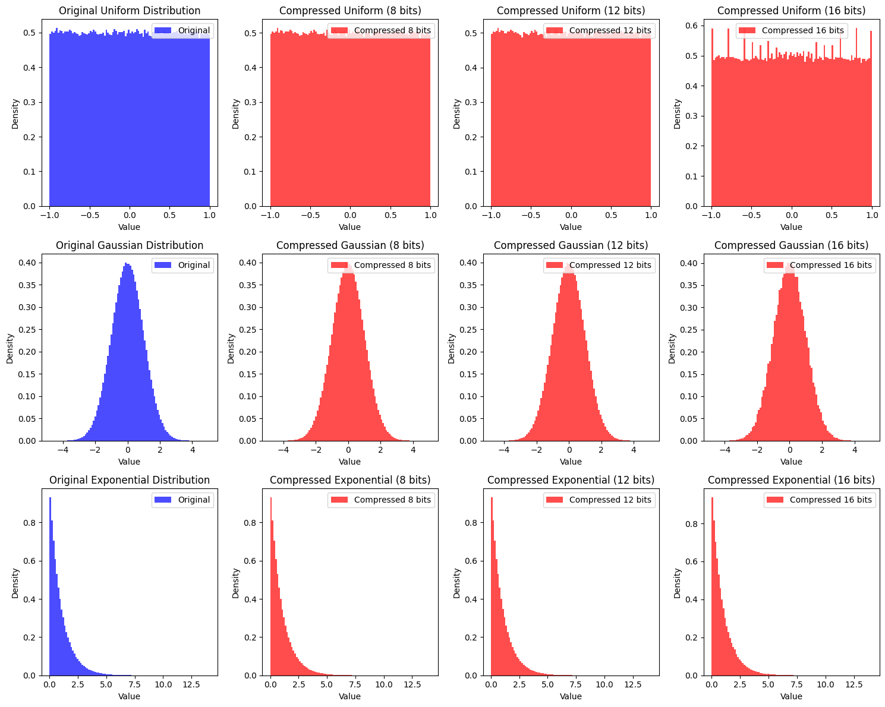

# Lossy Compression of Floating-Point Data

This project explores the effects of lossy compression on floating-point data by zeroing out the least significant bits (LSBs) of the mantissa. The goal is to analyze the impact on file size, Mean Squared Error (MSE), and statistical properties (mean, variance, and standard deviation) of the data.

## Experiment Setup
- **Data Generation**: Three types of distributions were generated, each containing 1,000,000 floating-point numbers:
  1. **Uniform Distribution**: Range `[-1, 1]`
  2. **Gaussian (Normal) Distribution**: Mean `0`, Standard Deviation `1`
  3. **Exponential Distribution**: Scale `1`
- **Compression Method**: The least significant bits (LSBs) of the mantissa in the floating-point representation were zeroed out. Three levels of compression were tested:
  - **8 bits zeroed**
  - **12 bits zeroed**
  - **16 bits zeroed**
- **Metrics**:
  - **File Size**: Size of the binary file before and after compression.
  - **Mean Squared Error (MSE)**: Difference between original and compressed data.
  - **Statistical Properties**: Mean, variance, and standard deviation of the data before and after compression.

---

## Results

### File Sizes
The file sizes before and after compression remained the same (`4,000,000 bytes` for all datasets). This is because the compression method does not reduce the number of bytes stored; it only reduces the precision of the data.

---

### Mean Squared Error (MSE)
The MSE increases as more bits are zeroed out, indicating a larger deviation from the original data.

| Distribution   | 8 Bits Zeroed      | 12 Bits Zeroed     | 16 Bits Zeroed     |
|----------------|--------------------|--------------------|--------------------|
| **Uniform**    | `0.0000000000`     | `0.0000000114`     | `0.0000029076`     |
| **Gaussian**   | `0.0000000002`     | `0.0000000431`     | `0.0000109827`     |
| **Exponential**| `0.0000000003`     | `0.0000000860`     | `0.0000220151`     |

---

### Statistical Properties
The statistical properties (mean, variance, and standard deviation) of the data were compared before and after compression. The results show minimal changes for 8 and 12 bits zeroed, but more significant changes for 16 bits zeroed.

#### Uniform Distribution
| Metric        | Original           | 8 Bits Zeroed      | 12 Bits Zeroed     | 16 Bits Zeroed     |
|---------------|--------------------|--------------------|--------------------|--------------------|
| **Mean**      | `0.0004959423`     | `0.0004959339`     | `0.0004959751`     | `0.00049643655`    |
| **Variance**  | `0.33373943`       | `0.33373302`       | `0.33363485`       | `0.33206558`       |
| **Std Dev**   | `0.57770187`       | `0.5776963`        | `0.5776113`        | `0.5762513`        |

#### Gaussian Distribution
| Metric        | Original           | 8 Bits Zeroed      | 12 Bits Zeroed     | 16 Bits Zeroed     |
|---------------|--------------------|--------------------|--------------------|--------------------|
| **Mean**      | `0.0005265852`     | `0.0005265776`     | `0.0005263744`     | `0.00052431563`    |
| **Variance**  | `0.99806225`       | `0.99804056`       | `0.9977098`        | `0.9924511`        |
| **Std Dev**   | `0.99903065`       | `0.9990198`        | `0.9988542`        | `0.9962184`        |

#### Exponential Distribution
| Metric        | Original           | 8 Bits Zeroed      | 12 Bits Zeroed     | 16 Bits Zeroed     |
|---------------|--------------------|--------------------|--------------------|--------------------|
| **Mean**      | `0.9999121`        | `0.99990106`       | `0.99973595`       | `0.9970984`        |
| **Variance**  | `1.0009854`        | `1.0009633`        | `1.0006323`        | `0.99534124`       |
| **Std Dev**   | `1.0004926`        | `1.0004816`        | `1.0003161`        | `0.9976679`        |

---

### Observations
1. **File Size**: The file size remains unchanged because the compression method does not reduce the number of bytes stored.
2. **MSE**: The MSE increases as more bits are zeroed out, indicating a larger deviation from the original data.
3. **Statistical Properties**: The mean, variance, and standard deviation remain relatively stable for 8 and 12 bits zeroed but show more significant changes for 16 bits zeroed.
4. **Impact on Distributions**:
   - The **Uniform Distribution** is the least affected by compression.
   - The **Gaussian Distribution** shows moderate changes in variance and standard deviation.
   - The **Exponential Distribution** is the most affected, especially for 16 bits zeroed.

---

### Visualizations
Below are the histograms comparing the original and compressed distributions for each bit level:

  

---

### Optimal Compression Levels for Different Use Cases

The choice of compression level (number of bits zeroed) depends on the specific use case and the trade-offs between precision, storage, and computational requirements. Below are some recommendations for different scenarios:

---

#### 1. **High-Precision Computing**
   - **Use Case**: Scientific simulations, financial modeling, or any application where data accuracy is critical.
   - **Recommendation**: Use minimal or no compression (e.g., **0–8 bits zeroed**).
   - **Reasoning**:
     - High-precision computing requires minimal loss of data fidelity.
     - Zeroing out too many bits can introduce significant errors, affecting the reliability of results.
     - The MSE and changes in statistical properties are minimal for 8 bits zeroed, making it a safe choice for high-precision applications.

---

#### 2. **Limited Storage Resources**
   - **Use Case**: Applications with strict storage constraints, such as edge devices, IoT sensors, or mobile applications.
   - **Recommendation**: Use moderate to high compression (e.g., **12–16 bits zeroed**).
   - **Reasoning**:
     - While the file size remains unchanged (since the number of bytes stored is the same), reducing precision can help in subsequent compression steps (e.g., using lossless compression algorithms like ZIP).
     - The MSE increases, but the trade-off may be acceptable if storage savings are prioritized over precision.

---

### Conclusion
This experiment demonstrates that zeroing out the least significant bits of floating-point data can introduce errors (as measured by MSE) and alter statistical properties, especially when a larger number of bits are zeroed out. However, the file size remains unchanged, as the compression method does not reduce the number of bytes stored. This technique may be useful in scenarios where reduced precision is acceptable, but it is not suitable for applications requiring exact data fidelity.

---
